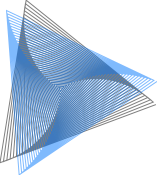

This repository contains plots created using [PenPlots.jl](https://github.com/paulgb/PenPlots.jl).
Each plot is a [Pluto.jl](https://github.com/fonsp/Pluto.jl) notebook and may have interactive elements (like sliders).

| Plot | YouTube video | Preview | Notes |
| ---- | ------------- | ------- | ----- |
| Moire Triangles | [YouTube](https://www.youtube.com/watch?v=O7mgvS0EF40) | | |
| Snowflake | [YouTube](https://www.youtube.com/watch?v=LSsMdzUpIhM) |  | |

